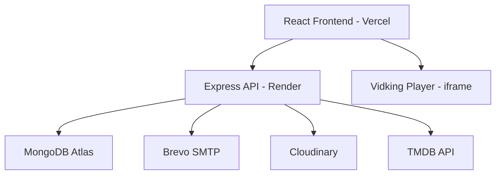

# 🎬 VauraPlay - Implementation Plan

## Tech Stack
| Layer | Technology |
|-------|-----------|
| Frontend | React 18 + Vite, Vanilla CSS (premium design), Framer Motion animations |
| Backend | Node.js + Express |
| Database | MongoDB Atlas (Mongoose ODM) |
| Auth | JWT + OTP (signup/login/forgot password) |
| Email | Brevo SMTP (automated emails) |
| Streaming | Vidking Player (iframe embed) |
| Movie Data | TMDB API |
| Cloud Storage | Cloudinary (avatar uploads) |
| Deploy | Vercel (frontend) + Render (backend) |

## Architecture

## Features Checklist

### Authentication & Security
- [x] JWT-based authentication
- [x] Signup with OTP verification
- [x] Login with OTP verification
- [x] Forgot password flow
- [x] Password reset with token
- [x] Rate limiting
- [x] Helmet security headers
- [x] CORS configuration

### Email System (Brevo SMTP)
- [x] Welcome email on signup
- [x] OTP emails for verification
- [x] Login notification emails
- [x] Forgot password emails
- [x] Account status notifications
- [x] Movie update notifications

### User Features
- [x] Profile with avatar (Cloudinary)
- [x] Watchlist (add/remove)
- [x] Continue watching (progress tracking)
- [x] Watch history
- [x] Account settings

### Streaming
- [x] Vidking Player integration
- [x] Movie playback
- [x] TV Series playback (season/episode)
- [x] Progress tracking via postMessage
- [x] Auto-play support

### Admin Panel
- [x] User management (view/ban/unban)
- [x] Platform statistics
- [x] Send movie update emails
- [x] View activity logs

### UI/UX
- [x] Premium dark theme
- [x] Glassmorphism effects
- [x] Smooth animations (Framer Motion)
- [x] Responsive design
- [x] Skeleton loaders
- [x] Hero banner with auto-rotation
- [x] Movie carousels
- [x] Search with debounce

## Pages
1. **Landing** - Public hero page
2. **Login** - Email + password + OTP
3. **Signup** - Registration + OTP verification
4. **Forgot Password** - Email-based reset
5. **Home** - Dashboard with carousels
6. **Browse** - Search & filter movies/TV
7. **Movie Detail** - Full movie info + cast + similar
8. **TV Detail** - Series info + season/episode picker
9. **Watch** - Vidking player embed
10. **Profile** - User settings + avatar
11. **Watchlist** - Saved content
12. **Admin Dashboard** - User & platform management
